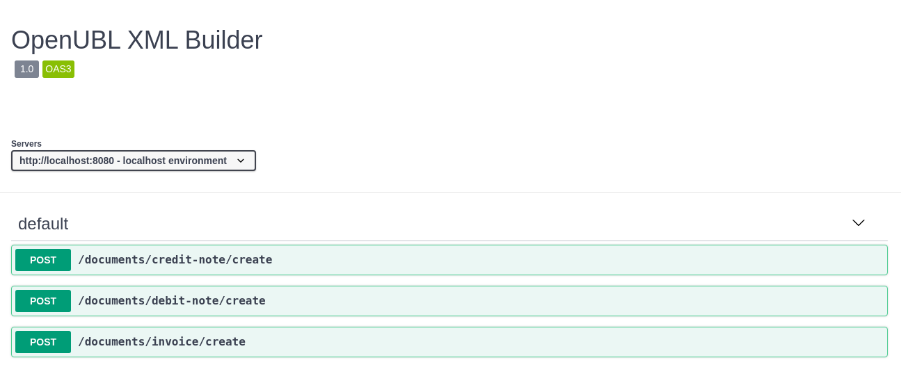

# xml-builder
[](https://dev.azure.com/project-openubl/xml-builder/_build/latest?definitionId=1&branchName=master)

Crea archivos XML basados en UBL 2.1 - Facturacion electrónica Peru

# Prerequisitos
- [Git](https://git-scm.com/)
- Java 8
- [Maven 3](https://maven.apache.org/download.cgi)

# Levantar el servidor localmente
- Descarga o clona xml-builder usando `git clone https://github.com/project-openubl/xml-builder.git`
- Abre un terminal y ubicate en la carpeta donde descargaste el proyecto y despues ejecuta `./mvnw compile quarkus:dev`
- Abre un navegador y abre [http://localhost:8080](http://localhost:8080)

**¡Felicitaciones! pudiste arrancar el proyecto localmente**

# Crear Factura UBL 2.1.
Para crear comprobantes debes de haber levantantado el servidor localmente.

XML Builder es muy sencillo de usar. En este ejemplo voy a crear una Factura.

Pasos:
1. Abrir un terminal
1. Ejecutar el comando de abajo
1. **¡Eso es todo! ¿Que fácil verdad?**

```

curl -X POST \
-H "Content-Type: application/json" \
-d '{
    "serie": "F001",
    "numero": 1,
    "fechaEmision": 1573247709344,
    "firmante": {
      "ruc": "12345678912",
      "razonSocial": "Razon Social Firmante"
    },
    "proveedor": {
      "ruc": "98765432198",
      "nombreComercial": "Nombre comercial proveedor",
      "razonSocial": "Razon social proveedor",
      "codigoPostal": "010101"
    },
    "cliente": {
      "tipoDocumentoIdentidad": "RUC",
      "numeroDocumentoIdentidad": "12312312312",
      "nombre": "Nombre o razon social cliente"
    },
    "detalle": [
      {
        "descripcion": "Descripcion del item en venta",
        "cantidad": 1,
        "precioUnitario": 100
      }
    ]
  }' \
http://localhost:8080/documents/invoice/create
```


## Rest Endpoints
Para saber saber más acerca de los endpoints visita:  [swaggerhu**b/project-openubl/xml-builder](https://app.swaggerhub.com/apis-docs/project-openubl/xml-builder)



