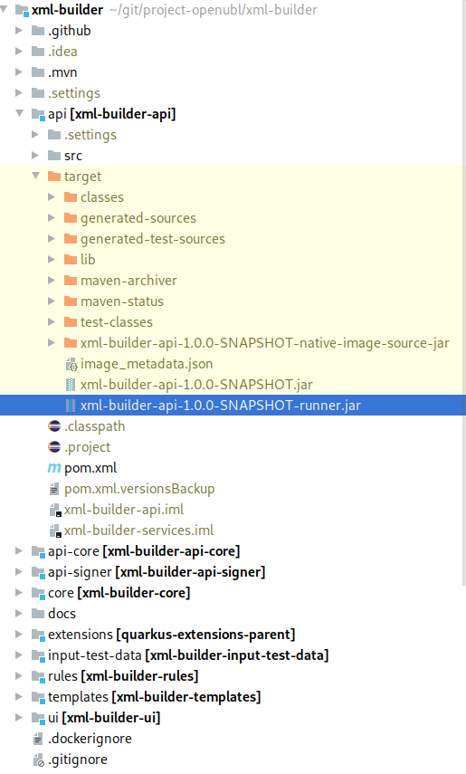
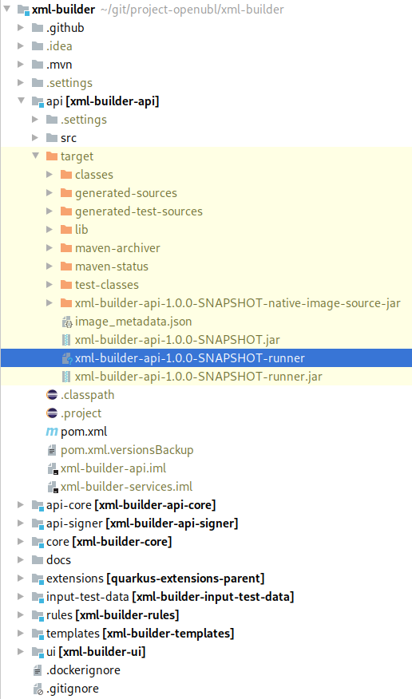

# Compilación nativa
## Compilación tradicional
El código fuente de ***XML Builder*** está escrito en Java. Como cualquier aplicación en Java, cuenta con archivos `.jar`
que pueden ser ejecutados en el JVM de Java. Los `.jar` del proyecto pueden ser descargados en [Releases](https://github.com/project-openubl/xml-builder/releases).
Cada release contiene un conjunto de archivos, por ejemplo `xml-builder-signer-${version}.tar.gz` que contiene los `.jar`.

Si deseas generar tus propios artefactos `.jar` puedes ejecutar el comando:

```
 ./mvnw clean install
```

Después de ejecutar el comando anterior podrás ver los artefactos en:
- `api/target/xml-builder-api-${version}-runner.jar`
- `api-signer/target/xml-builder-api-signer-${version}-runner.jar`

Puedes ejecutar los artefactos usando el comando:

```
java -jar api/target/xml-builder-api-${version}-runner.jar
```



## Compilacion usando GraalVM y Quarkus
Pre requisitos:
- Maven
- GraalVM
- Java

[GraalVM](https://www.graalvm.org/) es usado para generar ejecutables Java ultrarápidos y que consumen muy poca memora,
 (comparada con la memoria consumida por una aplicación Java estándard). Si deseas aprender
 más sobre GraalVM puedes leer [GraalVM Documentation](https://www.graalvm.org/docs/)

XML Builder utiliza [Quarkus](https://quarkus.io/) para poder generar ejecutables nativos,
que a su vez utiliza GraalVM por detráz. Si deseas aprender cómo crear ejecutables Java nativos
puedes leer [Quarkus - Building native image](https://quarkus.io/guides/building-native-image)

Si deseas generar tus artefactos para tu Sistema Operativo debes de ejecutar:
```
./mvnw -f api/pom.xml clean install -DskipTests
```

```
./mvnw -f api/pom.xml clean package -Pnative -DskipTests
```

El proceso puede tardar mucho tiempo. Empieza la compilacion y ve por un café.
Cuando la compilación nativa finalize, podrás ver el artefacto nativo:



El comando para ejecutar el artefacto nativo puede variar dependiendo de tu sistema operativo.
En este ejemplo usé Fedora para crear el artecto y puede ser ejecutar con el comando:

```
./api/target/xml-builder-api-${version}-runner
```

## Beneficios de la compilación nativa
- Permite reducir la velocidad de inicio de aplicaciones Java
- Reduce la memoria requerida para la ejecución de aplicaciones

Este es un pequeño ejemplo de lo que podamos lograr con GraalVM y Quarkus:


*Imagen tomada de la página oficial de [Quarkus](https://quarkus.io/)*
