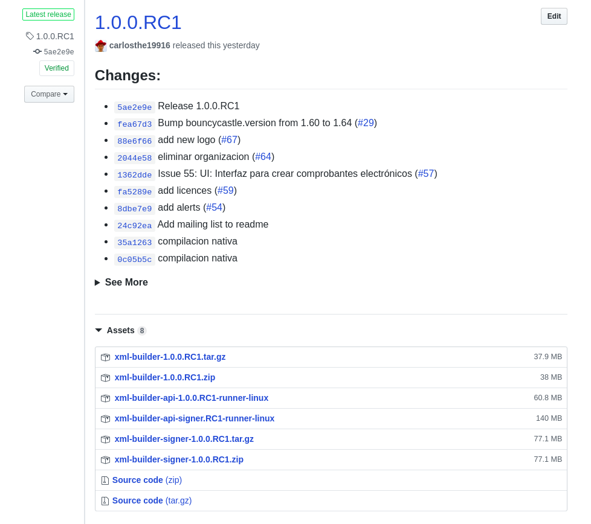
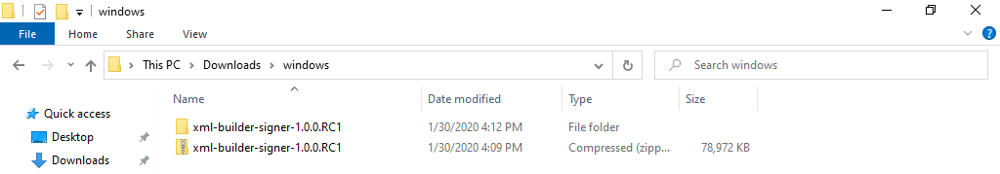
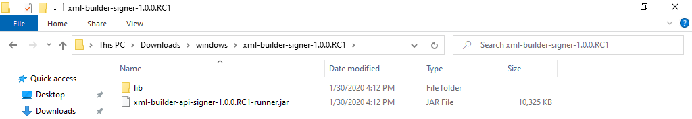
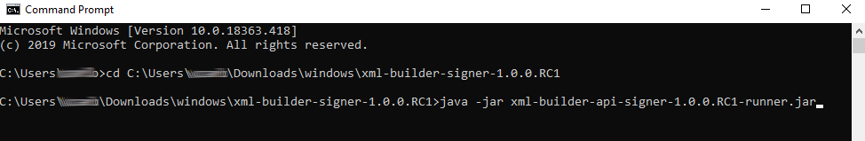
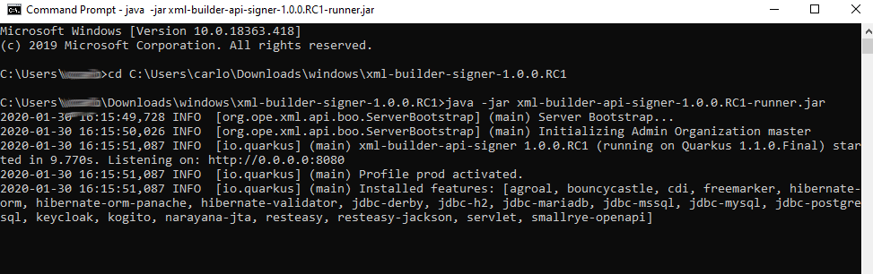

# Para usuarios Windows
Si usas el sistema operativo windows, deberías de ser capaz de levantar xml-builder y
xml-builder-signer sin ningun problema. Todos los comandos descritos en los siguientes
links son válidos:

- [Xml Builder.- Levantar y configurar servidor](./XB_INSTALAR_CONFIGURAR.md)
- [Xml Builder Siger.- Levantar y configurar servidor](./XBS_INSTALAR_CONFIGURAR.md)

# Si sólo quieres levantar los artefactos que vienen en el Release y experimentar
1. Descargar la última version disponible archivo `xml-builder-signer-*.zip` desde la página [Release](https://github.com/project-openubl/xml-builder/releases)

    

2. Descomprimir el archivo `.zip` descargado

    
    
    El contenido del archivo `.zip` debe de ser parecido a:
    

3. Abrir un terminal y dirigirse a la carpeta donde descomprimiste el archivo `.zip`
4. Levantar el servidor ejecutando el comando:

```
java -jar xml-builder-signer-*-runner.jar
```

Nota: recuerda cambiar el comando anterior y utilizar el nombre del archivo `.jar` según
la version que descargaste.



Debes de esperar unos segundos y deberías de ver el siguiente resultado:



***Abrir el navegador y dirigirte a http://localhost:8080/***
