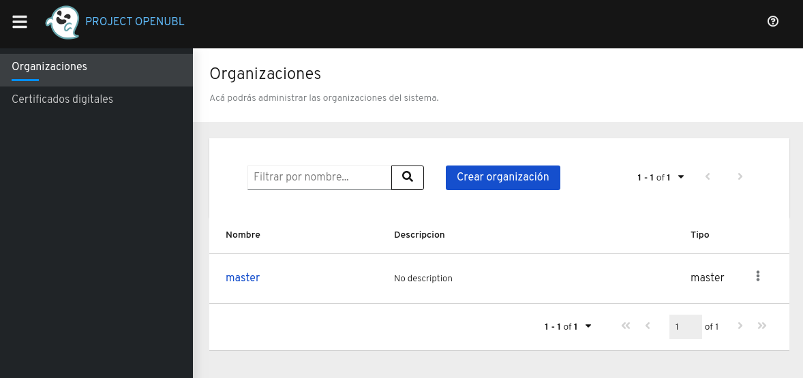

# Levantar el servidor XML Builder Signer
El servidor **XML Builder Signer** puede ser levandando utilizando diferentes métodos. Se recomienda utilizar Docker, Podman, Openshift, Kubernetes para produción; la lista de imágenes pueden ser encontradas acá https://hub.docker.com/r/projectopenubl/xml-builder-signer

# Docker
Requisitos:
1. Tener instalado [Docker](https://www.docker.com/). Puedes utilizar la siguiente [guía de instalación](https://docs.docker.com/install/)

## 1. PostgreSQL Example
### Create a user defined network

```
docker network create xml-builder-network
```

### Start a PostgreSQL instance
First start a PostgreSQL instance using the PostgreSQL docker image:

```
docker run -d --name postgres --net xml-builder-network \
-e POSTGRES_DB=db_name \
-e POSTGRES_USER=db_username \
-e POSTGRES_PASSWORD=db_password \
postgres
```

### Start a XML Builder instance
Start a XML Builder instance and connect to the PostgreSQL instance:

```
docker run --name xml-builder --net xml-builder-network -p 8080:8080 \
-e QUARKUS_DATASOURCE_URL=jdbc:postgresql://postgres:5432/db_name \
-e QUARKUS_DATASOURCE_USERNAME=db_username \
-e QUARKUS_DATASOURCE_PASSWORD=db_password \
-e QUARKUS_DATASOURCE_DRIVER=org.postgresql.Driver \
projectopenubl/xml-builder-signer
```

## 2. MariaDB Example
### Create a user defined network

```
docker network create xml-builder-network
```

### Start a MariaDB instance
First start a MariaDB instance using the MariaDB docker image:

```
docker run -d --name mariadb --net xml-builder-network \
-e MYSQL_ROOT_PASSWORD=password \
-e MYSQL_DATABASE=db_name \
-e MYSQL_USER=db_username \
-e MYSQL_PASSWORD=db_password \
mariadb
```

### Start a XML Builder instance
Start a XML Builder instance and connect to the MariaDB instance:

```
docker run --name xml-builder --net xml-builder-network \
-e QUARKUS_DATASOURCE_URL=jdbc:mariadb://mariadb:3306/db_name \
-e QUARKUS_DATASOURCE_USERNAME=db_username \
-e QUARKUS_DATASOURCE_PASSWORD=db_password \
-e QUARKUS_DATASOURCE_DRIVER=org.mariadb.jdbc.Driver \
projectopenubl/xml-builder-signer:194
```

# Java
Requisitos:
1. Tener instalado Java

Pasos para levantar el servidor
1. Descargar el servidor desde https://github.com/project-openubl/xml-builder/releases
1. Descomprimir el archivo descargado en el paso anterior
1. Abrir un terminal y ubicarse en la carpeta donde el servidor fue extraido
1. Ejecutar el siguiente comando: 

```
java -jar xml-builder-api-signer-*-runner.jar
```

Luego debes de abrir un navegador y dirigirte a http://localhost:8080

Despues de seguir cualquiera de los métodos anteriores, deberás ser capaz de ver la siguiente página:



# Container Registry
Las imágenes de **XML Builder** se encuentran en el registry de Docker:

https://hub.docker.com/r/projectopenubl/xml-builder-signer
