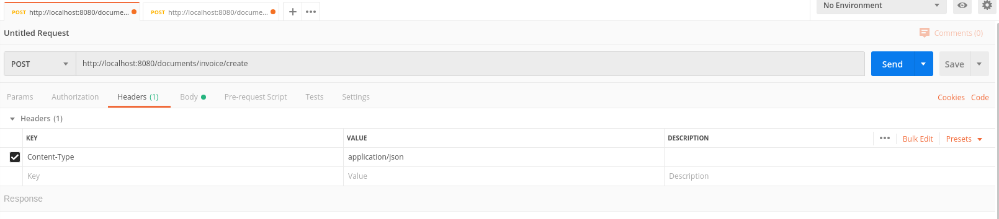
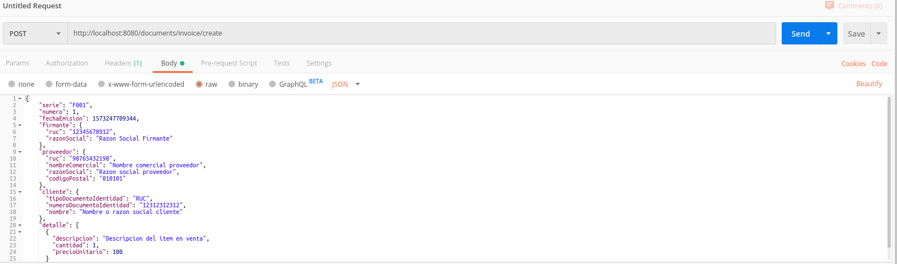

# Crear Comprobante Electrónico
## Requisitos
- Tener el servidor XML Builder levantado. Puedes leer [Levantar servidor](XB_INSTALAR_CONFIGURAR.md) para aprender cómo.

**XML Builder** está hecho para recibir peticiones HTTP por lo que podemos utilizar varios métodos para consumir sus servicios.
Veamos algunos de ellos

## 1. Utilizando el comando CURL en el terminal
> Si tienes windows puedes descargar CURL utilizando el siguiente enlace: https://curl.haxx.se/windows/

**El siguiente ejemplo creará una Factura Electrónica.**

Abra un terminal en su sistema operativo y ejecute el siguiente comando:

```
curl -X POST \
-H "Content-Type: application/json" \
-d '{
    "serie": "F001",
    "numero": 1,
    "fechaEmision": 1573247709344,
    "firmante": {
      "ruc": "12345678912",
      "razonSocial": "Razon Social Firmante"
    },
    "proveedor": {
      "ruc": "98765432198",
      "nombreComercial": "Nombre comercial proveedor",
      "razonSocial": "Razon social proveedor",
      "codigoPostal": "010101"
    },
    "cliente": {
      "tipoDocumentoIdentidad": "RUC",
      "numeroDocumentoIdentidad": "12312312312",
      "nombre": "Nombre o razon social cliente"
    },
    "detalle": [
      {
        "descripcion": "Descripcion del item en venta",
        "cantidad": 1,
        "precioUnitario": 100
      }
    ]
  }' \
http://localhost:8080/api/documents/invoice/create
```

- Debes de cambiar `http://localhost:8080` por la ubicación de tu servidor.
- Si deseas creear otro tipo de documento debes de cambiar `/invoice` por credit-note, debit-note, etc. Vea el [API](https://app.swaggerhub.com/apis-docs/project-openubl/xml-builder) para más información.

El ejemplo anterior creará un comprobante con los datos mínimos. **XML Builder** se encargará de generar todos los datos por ti.


## 2. Utilizando [Postman](https://www.getpostman.com/)
**El siguiente ejemplo creará una Factura Electrónica.**

- Instale Postman
- Abra Postman y cree una nueva peticion HTTP. Utilize las siguientes imágenes como guía:





Deberá utilizar el siguiente body:

```
{
    "serie": "F001",
    "numero": 1,
    "fechaEmision": 1573247709344,
    "firmante": {
      "ruc": "12345678912",
      "razonSocial": "Razon Social Firmante"
    },
    "proveedor": {
      "ruc": "98765432198",
      "nombreComercial": "Nombre comercial proveedor",
      "razonSocial": "Razon social proveedor",
      "codigoPostal": "010101"
    },
    "cliente": {
      "tipoDocumentoIdentidad": "RUC",
      "numeroDocumentoIdentidad": "12312312312",
      "nombre": "Nombre o razon social cliente"
    },
    "detalle": [
      {
        "descripcion": "Descripcion del item en venta",
        "cantidad": 1,
        "precioUnitario": 100
      }
    ]
  }
```

Por último deberá hacer clic en el boton SEND.

## API
Para conocer un poco más acerca del JSON que se envía a **XML Builder** vea la [documentación del API](https://app.swaggerhub.com/apis-docs/project-openubl/xml-builder)
